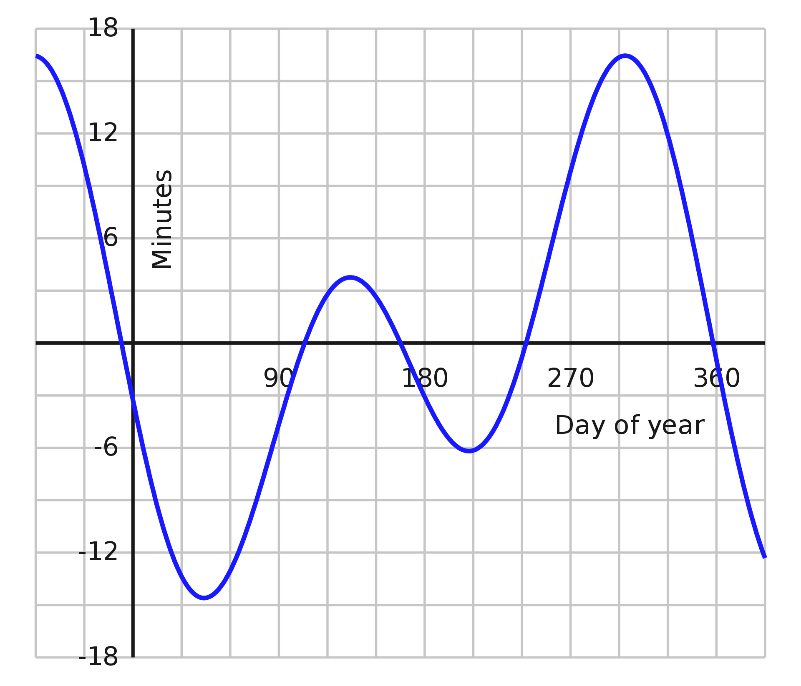

Analemmatic Sundial Generator
==============================

Sundials tell time based on the position of the Sun. Unfortunately, the Sun does not move
across the sky at a constant rate. This is due to two effects:
1. The eccentricity of Earth's orbit about the Sun
2. The obliquity (tilt) of Earth's rotational axis

The actual position of the Sun defines what is known as apparent solar time. Typically, we
measure the position of the Sun in the HA-Dec equatorial system, where:
- HA: hour angle, measured in hours between -12h and +12h with 0h corresponding to solar transit
- Dec: declination, measured in degrees between -90d and +90d with 0d corresponding to equatorial plane

A sundial has a fixed dial and does not account for this day-to-day difference in solar time. Instead,
it reports mean solar time, based on the position of the mean Sun. The mean Sun is the fictitious object
that moves across the sky at a constant rate equal to the mean rate of the actual Sun. The difference between
apparent solar time and mean solar time is known as the 
[equation of time](https://en.wikipedia.org/wiki/Equation_of_time) (EoT). A positive EoT means the Sun is
ahead of mean solar time and a negative EoT means that mean solar time is ahead of the Sun. The difference is zero
on 4 days: April 15, June 13, September 1, and December 25. The largest negative value is -14m15s on February 11
and the largest positive value is +16m25s on November 3.

If we want to compare mean solar time to local standard time, we must account for two other effects:
1. timezones
2. daylight saving time (DST)

Timezones define a uniform civil time over regions with a width of roughly 15 degrees
of longitude. The standard time of a time zone is defined by its standard meridian, which is any longitude
that is a multiple of 15 degrees. For CST, the standard meridian is -75 degrees, which results in a 5-hour
offset from UT. In the western hemisphere, every degree of longitude west of the standard meridian results in
a 4-minute difference between local standard time and mean solar time. 

Some timezones adjust the time by as much as an hour at certain times of year.
Daylight savings time (DST) in the US currently runs from 2:00am local time on the
second Sunday of March to 2:00am local time on the first Sunday of November, covering
34 weeks of the year. 

We can account for longitude in the construction of the sundial so that its dial reads 
local standard time up to corrections due to the EoT and DST. There is no perfect way to deal with DST.
We can pick standard time, daylight time, or some value inbetween. For example, US central time has
an average UTC offset of -5h20m46s accounting for DST.

We can easily calculate the position of the sun at a given utc. This can be either HA-Dec or Az-Alt.
What we really want to know is at what utc the sun will have a given local position. For instance,
what utc time is local solar noon on May 1, 2023? 

So we work in mean solar time. To convert to utc we need to know:
1. longitude
2. timezone

and once we have utc, we can get the actual position of the Sun. 